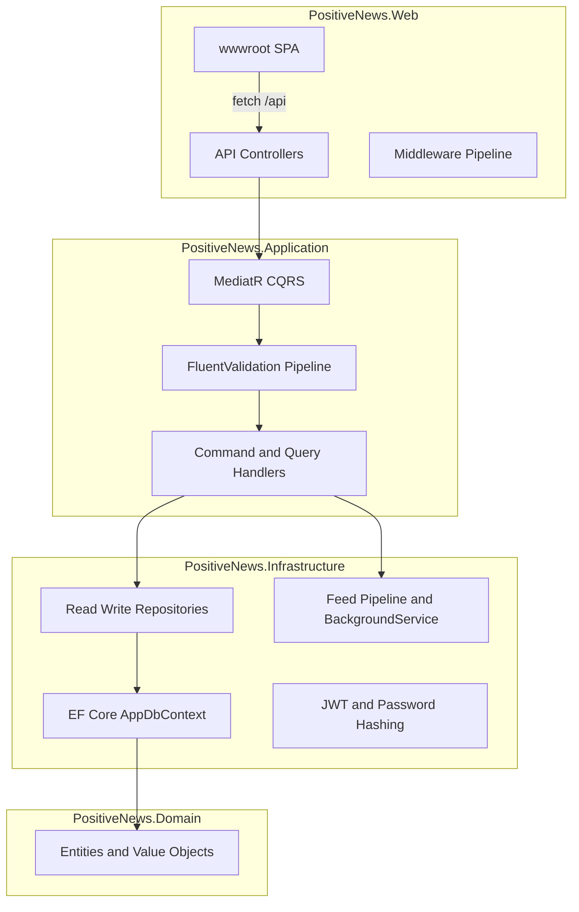
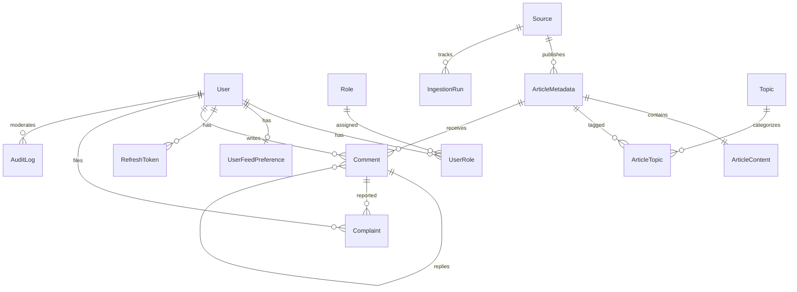
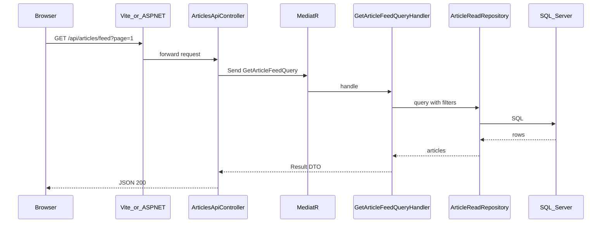
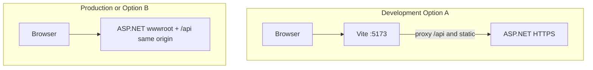

# PositiveNews

**Status:** Educational project · Development

A full-stack web platform that combats doom-scrolling by aggregating RSS news from trusted sources, scoring articles for positivity (0.0–1.0), and presenting a configurable, filterable feed with community features and an admin command center.

---

## At a Glance

**For reviewers, teammates, and employers** — what this project demonstrates in under a minute.

| | |
|---|---|
| **What it is** | Positive-news reader: ingest → score → store → browse, with personalization, comments, and moderation |
| **What was built** | React SPA + ASP.NET Core REST API + SQL Server + scheduled RSS ingestion background service |
| **Architecture** | Clean Architecture (Domain → Application → Infrastructure → Web), CQRS via MediatR, JWT authentication, EF Core migrations |
| **Scale** | 4 production projects, 4 test projects, 16 domain entities, 7 API controllers, React admin panel, automated ingestion pipeline |

**Engineering highlights**

- Layered backend with read/write repository split, Unit of Work, and rich domain entities
- CQRS command/query handlers with FluentValidation pipeline before MediatR dispatch
- RFC 7807 Problem Details for API errors; generic messages in non-Development environments
- Config-driven RSS ingestion: parse → validate → clean → enrich → positivity score → deduplicate → persist
- Batch article saves with per-item retry on unique-constraint races (`IngestionArticleBatchSaver`)
- React 19 SPA with JWT refresh, URL-driven feed state, and role-protected admin routes
- Startup auto-migration and config-driven seeding (roles, topics, sources, default admin)

---

## Features

### Ingestion and content

- **Ingestion engine** — periodic background polling of active RSS sources (`IngestionBackgroundService`)
- **Content distiller** — extracts core article text and short summaries from feed XML
- **Secure storage** — structured SQL Server database with separate metadata and content tables
- **Sentiment assessor** — key-phrase positivity analyzer scoring articles from 0.0 to 1.0
- **Manual trigger** — admins can start an ingestion cycle on demand

### Reader experience

- **Configurable feed** — public articles filtered by a minimum positivity threshold
- **Adaptive reader** — toggle between summary and full article views
- **Source filtering** — narrow the feed to specific trusted publishers
- **Topic filtering** — filter by domain (Technology, Health, Science, etc.)
- **Sorting** — by publication date, user feed preferences, or positivity score

### Personalization

- **User feed preferences** — all users can set minimum positivity and sort order (guests via URL; signed-in users also persist preferences to the server)

### Community

- **Comments** — authenticated users post comments on articles; domain model supports replies, but reply UI is **not implemented yet**
- **Complaints** — users can report comments for moderation

### Admin command center

- **Article moderation** — review and update article visibility/metadata
- **Source management** — edit trusted RSS sources
- **User management** — view and update user accounts (`isActive`, `emailConfirmed`); role assignment UI is **not implemented yet**
- **Comment moderation** — review comments and complaints
- **Audit logs** — track administrative actions
- **Ingestion monitoring** — view run history and service status

### Platform

- **Authentication** — JWT access tokens with refresh-token rotation
- **Logging** — Serilog to console and rolling daily files (`logs/positivenews-*.log`)
- **API documentation** — Swagger UI in Development (`/swagger`)

---

## Architecture

### Backend layers

The solution follows **Clean Architecture** with dependency direction inward:

```
PositiveNews.Web          → HTTP, controllers, SPA hosting, Swagger, JWT middleware
PositiveNews.Infrastructure → EF Core, repositories, ingestion, security, background jobs
PositiveNews.Application  → CQRS handlers, validators, DTOs, abstractions
PositiveNews.Domain       → Entities, value objects, domain rules (no external dependencies)
```



### Backend patterns and practices

| Pattern | Implementation |
|---------|----------------|
| **CQRS** | MediatR commands/queries in `PositiveNews.Application` |
| **Validation** | FluentValidation + `ValidationBehavior` pipeline |
| **Results** | `Result` / `Error` types mapped to HTTP via `ResultExtensions` |
| **Repositories** | Separate read and write interfaces; EF implementations in Infrastructure |
| **Unit of Work** | `IUnitOfWork` and `IIngestionUnitOfWork` for transaction boundaries |
| **Domain model** | Rich entities with private setters and factory methods |
| **Persistence** | EF Core `IEntityTypeConfiguration` per entity; schemas: `Identity`, `Catalog`, `Community`, `Admin` |
| **Mapping** | Riok.Mapperly source generators for API DTOs |
| **Exceptions** | `GlobalExceptionHandler` → RFC 7807 Problem Details |
| **Startup** | `DataSeeder` applies migrations and seeds from `SeedData` config section |
| **Background work** | `IngestionBackgroundService` (hosted service), interval from `Ingestion:IntervalMinutes` |

### Frontend approach

| Area | Choice |
|------|--------|
| **UI** | React 19 + TypeScript + Bootstrap 5 |
| **Build** | Vite 6 — production output to `PositiveNews.Web/wwwroot` |
| **Routing** | React Router 7 — pages under `ClientApp/src/pages/` |
| **Auth state** | `AuthProvider` context; tokens in `localStorage`; proactive refresh before expiry |
| **Feed state** | URL search params (source of truth) + debounced `PUT` to server when signed in |
| **API calls** | Plain `fetch` modules in `ClientApp/src/api/` (no axios, no React Query) |
| **Dev workflow** | Vite dev server on port **5173** proxies `/api`, `/Logos`, and `/Defaults` to ASP.NET |
| **Production** | ASP.NET serves built `wwwroot`; `MapFallbackToFile("index.html")` for client routing |

---

## Tech Stack

### Backend

| Category | Technologies |
|----------|--------------|
| Runtime | .NET 10 (`net10.0`) |
| Web | ASP.NET Core 10, JWT Bearer, Swagger (Swashbuckle) |
| Data | EF Core 10, SQL Server |
| Patterns | MediatR 13, FluentValidation 12, Mapperly |
| Logging | Serilog (console + rolling file) |
| RSS / HTML | `System.Xml.Linq` (feed XML), HtmlAgilityPack (HTML parsing) |

### Frontend

| Category | Technologies |
|----------|--------------|
| UI | React 19, TypeScript 5.7, Bootstrap 5.3 |
| Routing | React Router 7 |
| Build | Vite 6 |
| Tests | Vitest, Testing Library |

### Solution layout

Open [`src/src.sln`](src/src.sln) in Visual Studio.

```
src/
├── src.sln
├── PositiveNews.Domain/              # Entities, value objects, constants
├── PositiveNews.Application/         # CQRS handlers, validators, abstractions
├── PositiveNews.Infrastructure/      # EF Core, repos, ingestion, JWT, migrations
├── PositiveNews.Web/                 # API controllers, SPA host, appsettings
│   └── ClientApp/                    # React + Vite source
├── PositiveNews.Domain.Tests/
├── PositiveNews.Application.Tests/
├── PositiveNews.Infrastructure.Tests/
└── PositiveNews.Web.Tests/
```

---

## Prerequisites

Install the following before cloning and running locally:

| Software | Purpose |
|----------|---------|
| **Visual Studio 2026** | IDE — enable **ASP.NET and web development** and **.NET desktop development** workloads |
| **.NET 10 SDK** | Matches `TargetFramework` in all project files |
| **SQL Server** | LocalDB, Express, or full instance for `DefaultConnection` |
| **Node.js 22 LTS** (or 20+) | Frontend build and dev server |
| **npm** | Installed with Node; used in `ClientApp/` |
| **Git** | Clone the repository |

SQL Server Management Studio (SSMS) is optional but useful for inspecting the `PositiveNewsDb_Dev` database.

---

## Local Setup (Visual Studio 2026)

### 1. Clone and open the solution

```powershell
git clone <repository-url>
```

Open `src/src.sln` in Visual Studio 2026.

### 2. Set the startup project

Right-click **PositiveNews.Web** → **Set as Startup Project**.

### 3. Configure the database connection

Edit [`src/PositiveNews.Web/appsettings.json`](src/PositiveNews.Web/appsettings.json) and update `ConnectionStrings:DefaultConnection` to point to your SQL Server instance.

Example for a local named instance:

```json
"ConnectionStrings": {
  "DefaultConnection": "Server=YOUR_SERVER;Database=PositiveNewsDb_Dev;Trusted_Connection=True;MultipleActiveResultSets=true;TrustServerCertificate=True;Encrypt=False;"
}
```

Replace `YOUR_SERVER` with your machine name or `(localdb)\mssqllocaldb` for LocalDB. The committed file contains a developer-specific host name — you must change it on your machine.

### 4. Restore and build the backend

**Build → Build Solution** (or press Ctrl+Shift+B). NuGet packages restore automatically.

### 5. Install frontend dependencies

Open a terminal:

```powershell
cd src\PositiveNews.Web\ClientApp
npm ci
```

### 6. Choose a run mode

#### Option A — Full-stack UI development (recommended for frontend work)

Use two terminals:

**Terminal 1 — API**

Press **F5** or **Start** on `PositiveNews.Web`.

| Endpoint | URL |
|----------|-----|
| HTTP API | `http://localhost:56355` |
| HTTPS + Swagger | `https://localhost:56354/swagger` |

**Terminal 2 — Vite dev server**

```powershell
cd src\PositiveNews.Web\ClientApp
npm run dev
```

Open **http://localhost:5173** in the browser.

Vite proxies `/api/*`, `/Logos/*`, and `/Defaults/*` to the ASP.NET **HTTPS** port from [`launchSettings.json`](src/PositiveNews.Web/Properties/launchSettings.json) (server-side; the browser stays on `:5173`, so CORS is not required). HTTPS redirection is disabled in Development when the backend is hit over HTTP directly.

#### Option B — Backend with pre-built SPA

Build the frontend into `wwwroot`, then run only the .NET host:

```powershell
cd src\PositiveNews.Web\ClientApp
npm run build
```

Press **F5** on `PositiveNews.Web` and open the site on the ASP.NET HTTP/HTTPS ports from `launchSettings.json`.

### 7. First run

On startup (except in the `Testing` environment), the application:

1. Applies pending EF Core migrations (creates the database if missing)
2. Seeds roles, topics, RSS sources, and a default admin user from the `SeedData` configuration section

Watch the console or `logs/positivenews-*.log` for `Database migrations applied successfully.`

### 8. Verify

| Check | How |
|-------|-----|
| Feed UI | Open the UI URL (port 5173 in Option A, or ASP.NET port in Option B) |
| API (via Vite proxy) | `GET http://localhost:5173/api/sources` returns JSON |
| Admin | Log in with seeded credentials (see [Configuration](#configuration-and-secrets)) and open `/admin` |

### 9. Run tests (optional)

```powershell
cd src
dotnet test src.sln
```

```powershell
cd src\PositiveNews.Web\ClientApp
npm test
```

### Troubleshooting

| Problem | Fix |
|---------|-----|
| SQL connection error on startup | Correct `DefaultConnection` server name and ensure SQL Server is running |
| Blank page in Option B | Run `npm run build` in `ClientApp` |
| Missing logos in Option A | Ensure ASP.NET is running; Vite proxies `/Logos` and `/Defaults` from `wwwroot` |
| Port 5173 already in use | Stop the conflicting process or change the port in `vite.config.ts` |
| `npm ci` fails | Install Node.js 20 or later |
| CORS or API errors in Option A | Ensure the ASP.NET backend is running before `npm run dev` |

---

## Visual Schemas

### Entity relationships

Database schemas: **Identity**, **Catalog**, **Community**, **Admin**.



| Schema | Entities |
|--------|----------|
| **Identity** | `User`, `Role`, `UserRole`, `RefreshToken`, `UserFeedPreference`, `UserSourceFilter`, `UserTopicFilter` |
| **Catalog** | `Source`, `ArticleMetadata`, `ArticleContent`, `ArticleTopic`, `Topic`, `IngestionRun` |
| **Community** | `Comment`, `Complaint` |
| **Admin** | `AuditLog` |

Comment `ParentId` supports threaded replies in the data model; the UI currently lists top-level comments only.

### Ingestion data flow

```mermaid
flowchart LR
    subgraph scheduler [Background Scheduler]
        BG[IngestionBackgroundService]
    end
    subgraph cycle [Ingestion Cycle]
        Run[RunIngestionCycleCommand]
        Src[ProcessIngestionSourceCommand per Source]
    end
    subgraph pipeline [Feed Pipeline]
        Read[FeedReader RSS HTTP]
        Process[FeedProcessingPipeline]
        Parse[Parse and Validate]
        Clean[HTML Clean and Enrich]
        Score[Positivity Analyzer]
        Dedup[Deduplicator]
        Save[PersistIngestedArticles]
    end
    DB[(SQL Server)]

    BG --> Run
    Run --> Src
    Src --> Read --> Process
    Process --> Parse --> Clean --> Score --> Dedup --> Save --> DB
```



**Pipeline steps per source**

1. `IngestionBackgroundService` wakes on configured interval (`Ingestion:IntervalMinutes`)
2. `RunIngestionCycleCommand` loads active sources and settings
3. `FeedReader` downloads feed XML (`System.Xml.Linq`) → `FeedProcessingPipeline` parses items, validates, cleans HTML (HtmlAgilityPack), enriches metadata, scores positivity
4. Existing articles are detected by external keys; duplicates are skipped
5. `IngestionArticleBatchSaver` persists new articles (batch save with per-item fallback on unique-constraint conflicts)
6. `IngestionRun` records success, partial success, or failure per source

### API request flow (feed example)



### Dev vs production hosting



| Mode | UI served from | API |
|------|----------------|-----|
| Dev (Option A) | `http://localhost:5173` | Vite proxies `/api` → ASP.NET |
| Prod / Option B | ASP.NET `wwwroot` | Same origin `/api` |

---

## Configuration and Secrets

Configuration lives primarily in [`src/PositiveNews.Web/appsettings.json`](src/PositiveNews.Web/appsettings.json).

### Configuration sections

| Section | Required | Description |
|---------|----------|-------------|
| `ConnectionStrings:DefaultConnection` | Yes | SQL Server connection string |
| `Jwt:SecretKey` | Yes | HMAC-SHA256 signing key for JWT — **use a strong secret outside local dev** |
| `Jwt:Issuer` | Yes | Token issuer (default: `PositiveNews.Web`) |
| `Jwt:Audience` | Yes | Token audience (default: `PositiveNews.Client`) |
| `Jwt:AccessTokenMinutes` | No | Access token lifetime (default: `30`) |
| `Jwt:RefreshTokenDays` | No | Refresh token lifetime (default: `7`) |
| `Ingestion:IntervalMinutes` | No | Background ingestion interval in minutes (default: `60`) |
| `ArticleFeed:DefaultPageSize` | No | Default feed page size (default: `10`) |
| `IngestionSettings` | No | Positivity lexicon, HTML cleaner rules, per-source topic mappings |
| `SeedData` | No | Bootstrap roles, RSS sources, and topics on first run |
| `Serilog` | No | Log levels (console and file sinks configured in code) |
| `AllowedHosts` | No | Host filtering (default: `*`) |

### Seeded defaults (first run)

| Item | Value |
|------|-------|
| Admin email | `admin@positivenews.local` |
| Admin password | `Admin123!` |
| Roles | `Admin`, `Moderator`, `User` |

Change the admin password after first login in any shared or deployed environment.

### Overriding configuration

| Method | Use case |
|--------|----------|
| `appsettings.Development.json` | Local overrides (not committed with secrets) |
| **User Secrets** (Visual Studio → right-click project → Manage User Secrets) | Recommended for local `Jwt:SecretKey` and connection string |
| **Environment variables** | Production / CI — use `__` for nesting: `ConnectionStrings__DefaultConnection`, `Jwt__SecretKey` |
| `appsettings.Testing.json` | Used only by `PositiveNews.Web.Tests` (LocalDB); not loaded during normal F5 |

### Security notes

- The committed `appsettings.json` contains a **development-only** JWT secret and a machine-specific SQL Server host. Do not use these values in production.
- Do not commit production connection strings or secrets to source control.
- Swagger is enabled only when `ASPNETCORE_ENVIRONMENT=Development`.

### Optional environment variables (frontend)

| Variable | Purpose |
|----------|---------|
| `VITE_DEV_API_PROXY_TARGET` | Override Vite proxy target (default: HTTPS URL from `launchSettings.json`, then HTTP) |
| `VITE_API_BASE` | API base URL for production builds (default: empty → relative `/api`) |

---

## Running Tests

**Backend** (from `src/`):

```powershell
dotnet test src.sln
```

**Frontend** (from `src/PositiveNews.Web/ClientApp/`):

```powershell
npm test
```

Test projects cover domain rules, application handlers, infrastructure services (including ingestion), and Web API integration tests.

---

## Project Structure

```
ITAcademy/
├── README.md
└── src/
    ├── src.sln
    ├── PositiveNews.Domain/
    │   ├── Entities/
    │   ├── ValueObjects/
    │   └── Constants/
    ├── PositiveNews.Application/
    │   ├── Commands/ / Queries/
    │   ├── CommandHandlers/ / QueryHandlers/
    │   ├── Abstractions/
    │   └── Services/Ingestion/
    ├── PositiveNews.Infrastructure/
    │   ├── Persistence/          # DbContext, migrations, repositories, seeding
    │   ├── Ingestion/              # Feed pipeline, positivity analyzer
    │   ├── BackgroundJobs/         # IngestionBackgroundService
    │   └── Security/               # JWT, password hashing
    ├── PositiveNews.Web/
    │   ├── Api/                    # REST controllers
    │   ├── Extensions/             # Pipeline, auth, Swagger, Serilog
    │   ├── ClientApp/              # React + Vite SPA source
    │   ├── wwwroot/                # Built SPA + static assets (Logos, Defaults)
    │   └── appsettings.json
    └── *.Tests/                    # xUnit test projects
```
